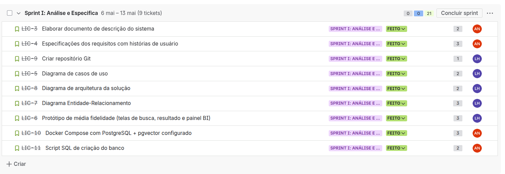
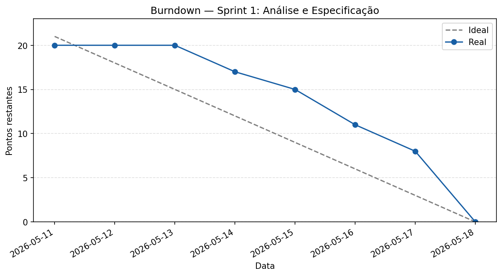

# Sprint 1 — Análise e Especificação

Período: 6 de maio a 13 de maio de 2026
Total de pontos: 21
Todas as tarefas foram concluídas

---

## Planning Poker

| Tarefa | Alan | Luís Henrique | Pontuação final |
|---|---|---|---|
| LIC-3 Elaborar documento de descrição do sistema | 2 | 3 | 2 |
| LIC-4 Especificações dos requisitos com histórias de usuário | 3 | 3 | 3 |
| LIC-9 Criar repositório Git | 1 | 1 | 1 |
| LIC-5 Diagrama de casos de uso | 3 | 2 | 2 |
| LIC-8 Diagrama de arquitetura da solução | 2 | 2 | 2 |
| LIC-7 Diagrama Entidade-Relacionamento | 3 | 3 | 3 |
| LIC-6 Protótipo de média fidelidade | 5 | 3 | 3 |
| LIC-10 Docker Compose com PostgreSQL e pgvector | 3 | 5 | 3 |
| LIC-11 Script SQL de criação do banco | 2 | 2 | 2 |

---

## Kanban (print do cronograma, pois no quadro ficou ruim pela quantidade de itens)

---

## Burndown

---

## Artefatos produzidos

- Documento de descrição do sistema
- Especificações dos requisitos com histórias de usuário
- Repositório Git
- Diagrama de casos de uso
- Diagrama de arquitetura da solução
- Diagrama Entidade-Relacionamento
- Protótipo de média fidelidade
- Docker Compose com PostgreSQL e pgvector configurado
- Script SQL de criação do banco

---

## Retrospectiva

**O que funcionou bem**

A equipe chegou a uma definição interessante do tema do projeto e conseguiu alinhar o tema aos requisitos técnicos da disciplina, produzindo todos os artefatos previstos dentro do prazo

**O que não funcionou**

A sprint teve início desorganizado em por causa de mudanças na composição da equipe. A produção ficou concentrada nos últimos dias desnecessariamente. A conciliação com a rotina fora da faculdade foi um fator muito limitante

**O que muda na próxima sprint**

Distribuir o trabalho de forma mais uniforme ao longo da semana, com alinhamentos diários entre os membros pelo WhatsApp para evitar que as entregas se acumulem próximo ao prazo
