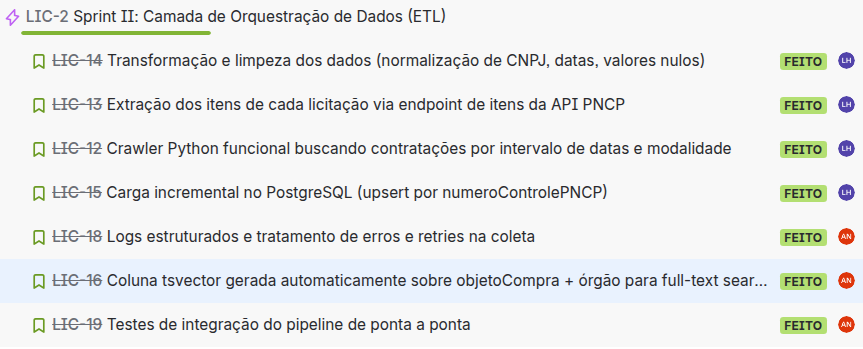
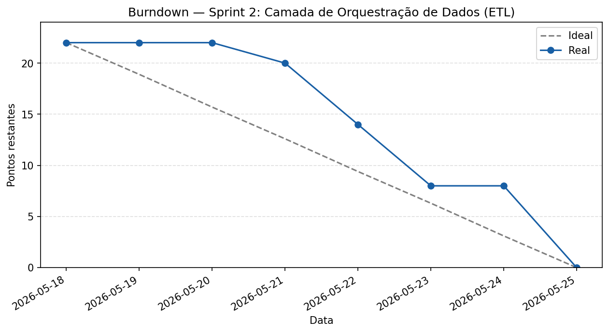

# Sprint 2 Camada de Orquestração de Dados (ETL)

Período: 18 de maio a 25 de maio de 2026
Total de pontos: 22
Todas as tarefas foram concluídas

---

## Planning Poker

| Tarefa | Alan | Luís Henrique | Pontuação final |
|---|---|---|---|
| LIC-14 Transformação e limpeza dos dados (normalização de CNPJ, datas, valores nulos) | 3 | 3 | 3 |
| LIC-13 Extração dos itens de cada licitação via endpoint de itens da API PNCP | 5 | 3 | 3 |
| LIC-12 Crawler Python funcional buscando contratações por intervalo de datas e modalidade | 5 | 4 | 4 |
| LIC-15 Carga incremental no PostgreSQL (upsert por numeroControlePNCP) | 3 | 3 | 3 |
| LIC-18 Logs estruturados e tratamento de erros e retries na coleta | 2 | 2 | 2 |
| LIC-16 Coluna tsvector gerada automaticamente sobre objetoCompra e órgão | 3 | 3 | 3 |
| LIC-19 Testes de integração do pipeline de ponta a ponta | 5 | 3 | 4 |

---

## Kanban

---

## Burndown

---

## Artefatos produzidos

### Crawler ETL

Módulo Python funcional de coleta, transformação e carga de licitações do PNCP no PostgreSQL

### Demais artefatos

- [Repositório do projeto](https://github.com/LuisHBM/licitai)
- [Repositório de documentação](https://github.com/LuisHBM/tees-docs)

---

## Retrospectiva

**O que funcionou bem**

A sprint teve um volume alto de entregas técnicas e com muitas dificuldades de acesso à API do PNCP, sendo necessárias soluções com retry e tratamento de erros que tornaram fizeram o crawler funcionar e se integrar com o banco. Houve uma sensação melhor de distribuição do trabalho em relação à sprint anterior

**O que não funcionou**

Os mesmos problemas da sprint anterior se mantiveram: dailies sem constância e acúmulo de entregas no final da sprint. As restrições da API do PNCP geraram retrabalho e consumiram tempo não planejado

**O que muda na próxima sprint**

Apesar da melhora na percepção de distribuição, o acúmulo no final da sprint ainda acontece, e é problemático exatamente quando as tarefas atingem escopo não planejado
