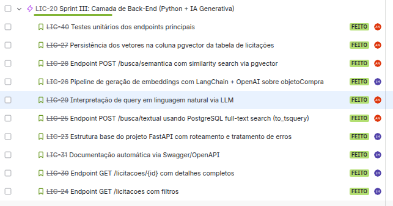
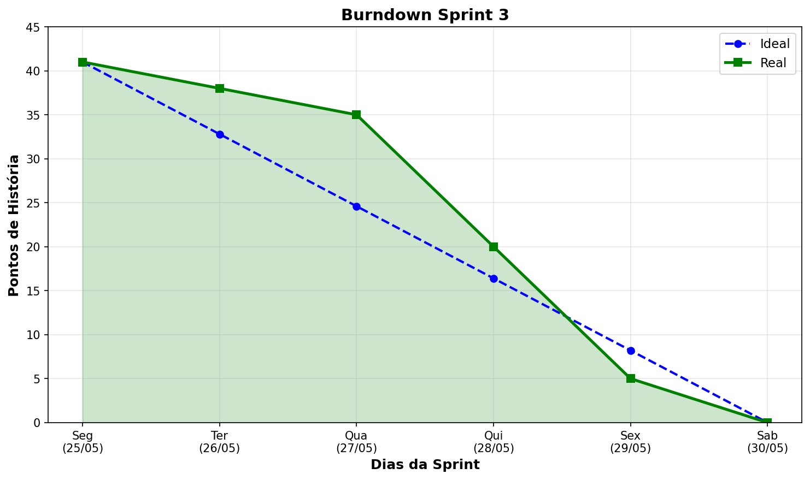

# Sprint 3 Camada de Back-End (Python + IA Generativa)

Período: 25 de maio a 1 de junho de 2026
Total de pontos: 41
Todas as tarefas foram concluídas

---

## Planning Poker

| Tarefa | Alan | Luís Henrique | Pontuação final |
|---|---|---|---|
| LIC-20 Sprint III: Camada de Back-End (Python + IA Generativa) | 4 | 4 | 4 |
| LIC-49 Testes unitários dos endpoints principais | 3 | 3 | 3 |
| LIC-27 Persistência dos vetores na coluna pgvector da tabela de licitações | 3 | 3 | 3 |
| LIC-28 Endpoint POST /busca/semantica com similarity search via pgvector | 6 | 6 | 6 |
| LIC-26 Pipeline de geração de embeddings com LangChain + OpenAI sobre objetoCompra | 5 | 6 | 6 |
| LIC-29 Interpretação de query em linguagem natural via LLM | 5 | 5 | 5 |
| LIC-25 Endpoint POST /busca/textual usando PostgreSQL full-text search (ts_query) | 4 | 4 | 4 |
| LIC-23 Estrutura base do projeto FastAPI com roteamento e tratamento de erros | 2 | 2 | 2 |
| LIC-31 Documentação automática via Swagger/OpenAPI | 2 | 2 | 2 |
| LIC-30 Endpoint GET /licitacoes/(id) com detalhes completos | 3 | 3 | 3 |
| LIC-24 Endpoint GET /licitacoes com filtros | 3 | 3 | 3 |

---

## Kanban

---

## Burndown

---

## Artefatos produzidos

### API REST em FastAPI

Servidor Python com endpoints para buscas semântica e textual em licitações públicas, integrando:
- Busca por similaridade semântica via pgvector + OpenAI embeddings
- Busca textual com full-text search do PostgreSQL
- Interpretação de queries em linguagem natural via LLM
- Endpoints de listagem e detalhes com filtros

### Testes unitários

Suite de testes cobrindo todos os endpoints principais com validação de entrada e saída

### Demais artefatos

- [Repositório do projeto](https://github.com/LuisHBM/licitai)
- [Repositório de documentação](https://github.com/LuisHBM/tees-docs)
- Documentação automática via Swagger/OpenAPI
- Pipeline de embeddings com LangChain e OpenAI

---

## Retrospectiva

**O que funcionou bem**

O uso de IA acelerou muito o desenvolvimento, sendo capaz de realizar o trabalho bruto

**O que não funcionou**

Os problemas estruturais das sprints anteriores persistiram: ausência de dailies consistentes e acúmulo de entregas próximo ao prazo. Problemas na integração local com o banco hospedado no Supabase, por ser IPv6 por padrão

**O que muda na próxima sprint**

Melhor organização de tempo
