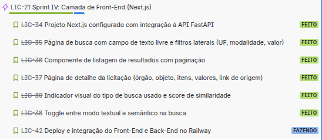
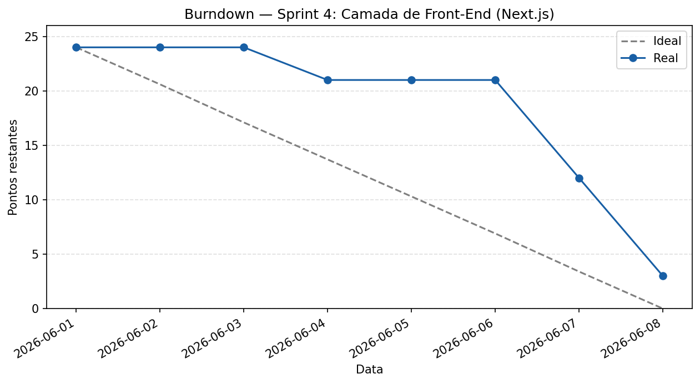
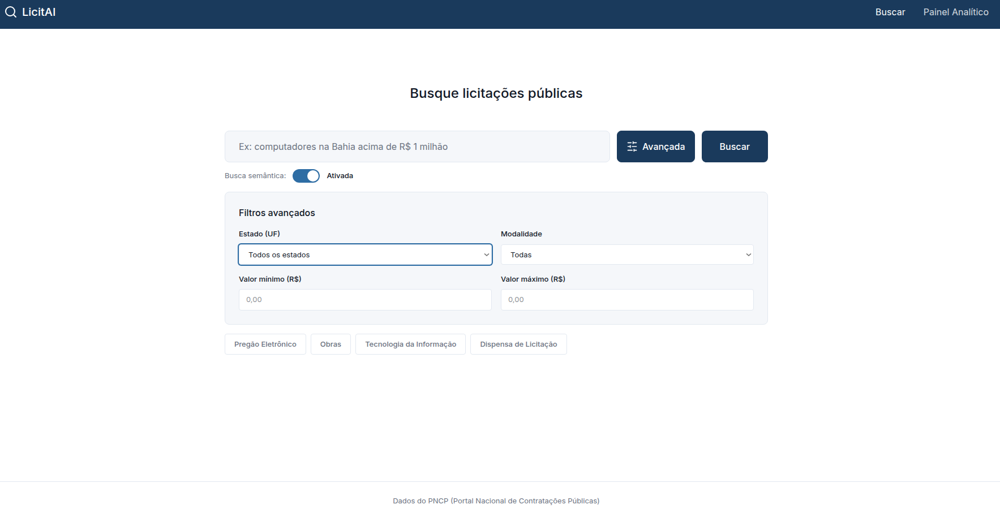
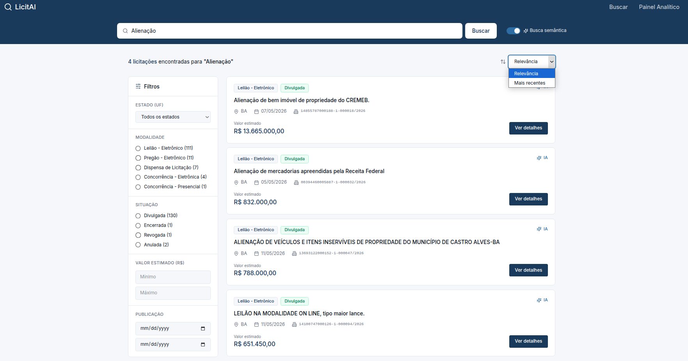
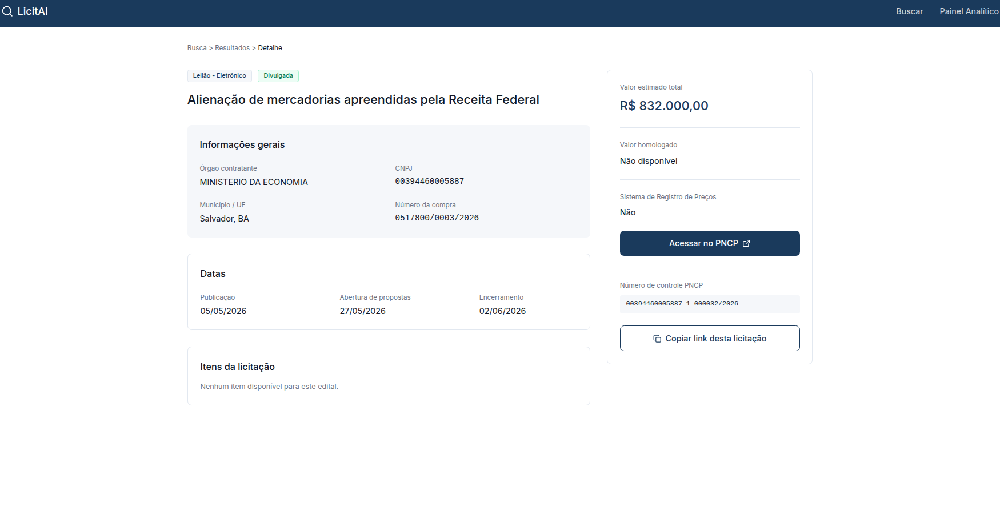

# Sprint 4 Camada de Front-End (Next.js)

Período: 1 de junho a 8 de junho de 2026
Total de pontos: 24
A tarefa LIC-42 (Deploy e integração) ficou pendente; as demais foram concluídas

---

## Planning Poker

| Tarefa | Alan | Luís Henrique | Pontuação final |
|---|---|---|---|
| LIC-34 Projeto Next.js configurado com integração à API FastAPI | 3 | 3 | 3 |
| LIC-35 Página de busca com campo de texto livre e filtros laterais (UF, modalidade, valor) | 5 | 5 | 5 |
| LIC-36 Componente de listagem de resultados com paginação | 4 | 4 | 4 |
| LIC-37 Página de detalhe da licitação (órgão, objeto, itens, valores, link de origem) | 4 | 4 | 4 |
| LIC-39 Indicador visual do tipo de busca usado e score de similaridade | 2 | 2 | 2 |
| LIC-38 Toggle entre modo textual e semântico na busca | 3 | 3 | 3 |
| LIC-42 Deploy e integração do Front-End e Back-End no Railway | 3 | 3 | 3 |

---

## Kanban

---

## Burndown

---

## Artefatos produzidos

### Interface web em Next.js

### Tela inicial

### Tela de resultados

### Tela de detalhe

### Demais artefatos

- [Repositório do projeto](https://github.com/LuisHBM/licitai)
- [Repositório de documentação](https://github.com/LuisHBM/tees-docs)

---

## Retrospectiva

**O que funcionou bem**

A IA ajudou muito na geração das telas a partir do protótipo, sendo necessários apenas ajustes pontuais

**O que não funcionou**

O deploy no Railway do back-end e do front-end funcionou individualmente, mas houve problemas na comunicação entre os dois serviços, incluindo com o banco hospedado no Supabase. O gerenciamento do tempo também foi bem complicado e a maior parte da produção ficou concentrada no fim da sprint

**O que muda na próxima sprint**

Resolver a integração entre os serviços no deploy e melhorar o gerenciamento do tempo, distribuindo melhor as entregas ao longo da sprint
