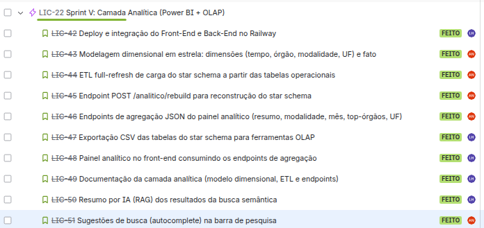
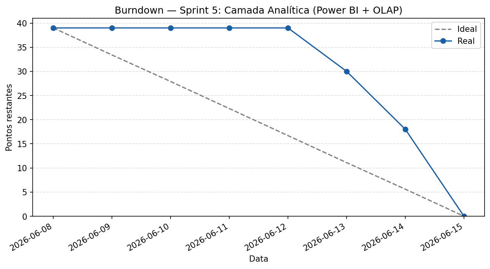
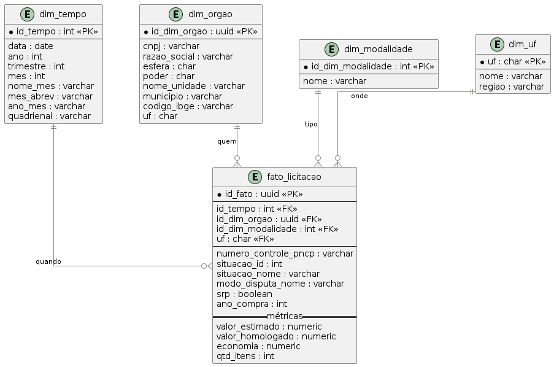
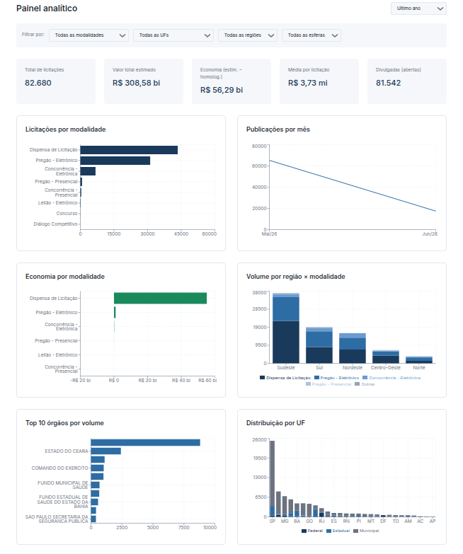
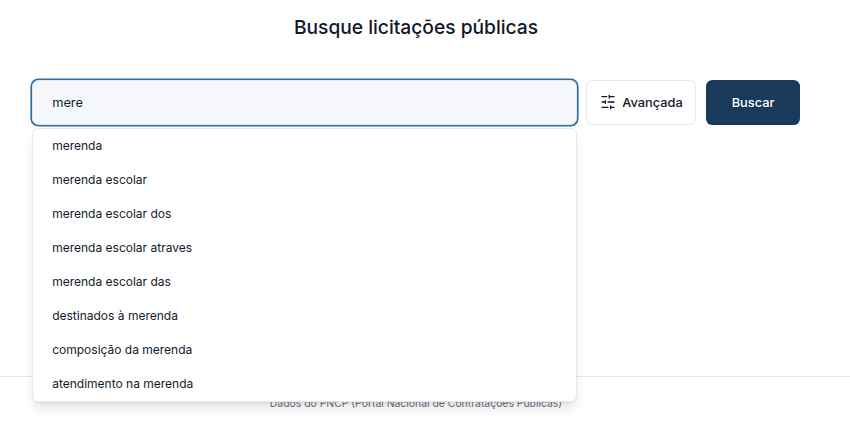

# Sprint 5 Camada Analítica (Power BI + OLAP)

Período: 8 de junho a 15 de junho de 2026
Total de pontos: 39
Todas as tarefas planejadas foram concluídas, incluindo a LIC-42 (Deploy e integração), que havia ficado pendente na Sprint 4

---

## Planning Poker

| Tarefa | Alan | Luís Henrique | Pontuação final |
|---|---|---|---|
| LIC-42 Deploy e integração do Front-End e Back-End no Railway | 3 | 3 | 3 |
| LIC-43 Modelagem dimensional em estrela: dimensões (tempo, órgão, modalidade, UF) e fato | 4 | 5 | 5 |
| LIC-44 ETL full-refresh de carga do star schema a partir das tabelas operacionais | 6 | 6 | 6 |
| LIC-45 Endpoint POST /analitico/rebuild para reconstrução do star schema | 2 | 2 | 2 |
| LIC-46 Endpoints de agregação JSON do painel analítico (resumo, modalidade, mês, top-órgãos, UF) | 5 | 4 | 5 |
| LIC-47 Exportação CSV das tabelas do star schema para ferramentas OLAP | 3 | 3 | 3 |
| LIC-48 Painel analítico no front-end consumindo os endpoints de agregação | 6 | 5 | 5 |
| LIC-49 Documentação da camada analítica (modelo dimensional, ETL e endpoints) | 2 | 2 | 2 |
| LIC-50 Resumo por IA (RAG) dos resultados da busca semântica | 4 | 5 | 5 |
| LIC-51 Sugestões de busca (autocomplete) na barra de pesquisa | 3 | 2 | 3 |

---

## Kanban

---

## Burndown

---

## Artefatos produzidos

### Modelo dimensional (star schema)

### Painel analítico

### Resumo por IA (RAG) dos resultados

### Sugestões de busca (autocomplete)

### Demais artefatos

- [Repositório do projeto](https://github.com/LuisHBM/licitai)
- [Repositório de documentação](https://github.com/LuisHBM/tees-docs)

---

## Retrospectiva

**O que funcionou bem**

O star schema saiu de forma intuitiva a partir do banco principal. Mesmo com poucos dados coletados (pouco mais de um mês), foi o suficiente para alimentar o dashboard.

**O que não funcionou**

Uma licitação com valor que estourou o limite de float distorceu os valores do dashboard. A indexação dos embeddings é demorada, então boa parte do acervo ainda ficou sem indexação. A otimização das sugestões de busca deu trabalho, e as entregas se concentraram no fim da sprint.

**Encerramento e aprendizados**

O projeto foi importante para entender tanto a parte de Scrum (sprints, burndown, artefatos) quanto a parte técnica com a qual tínhamos menos familiaridade, principalmente embeddings e indexação.
